# README

    

  
  

  

- 🔭 I’m currently working on Autonomous Navigation
- 🌱 I’m currently learning 3rd Btech on Muthooth Institute of Technology and Science
- 👯 I’m looking to collaborate on projects based on AI / ML / Aerial Drone / Underwater Sub 
- 🤔 I’m looking for help with implementation of begginer to all the way till  advanced logics on autonomy navigation on UAV / Underwater
- 📫 How to reach me: mail:prathyushrnair@gmail.com 
- ⚡ Fun fact: Just a regualr normal mtf... 

